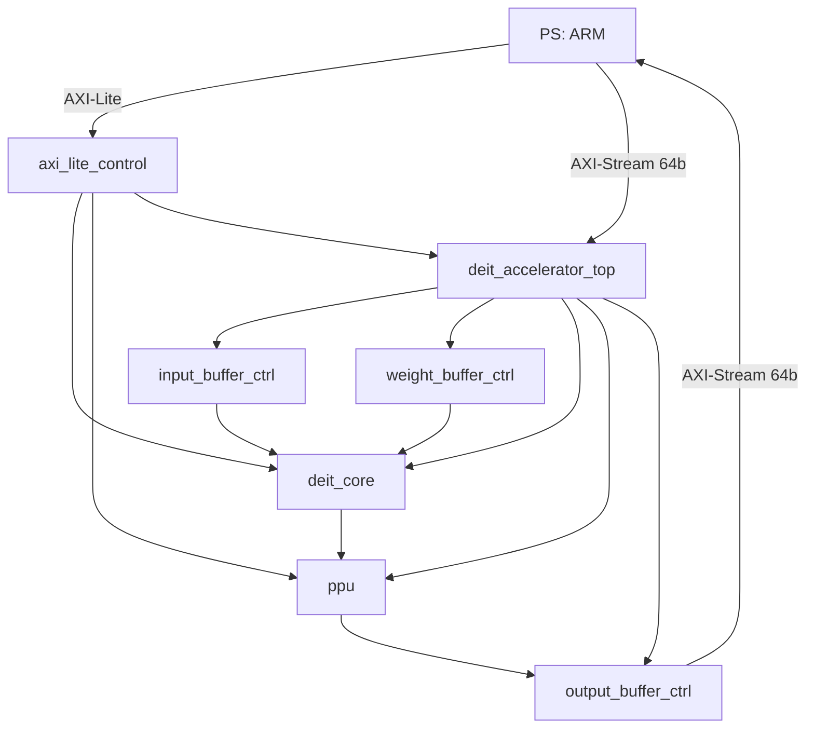
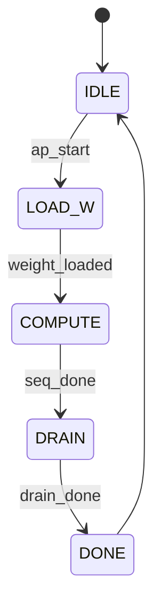

# PL 侧 RTL 项目总说明书 (DeiT 加速器, 完整版)

【UTF-8文档校验行】：UTF8_TEST=中文，如果看到正常中文说明编码正确。

版本：2.1
日期：2026-03-08
覆盖范围：src/rtl 以及 docs 中相关模块规格书
编码：UTF-8

---

## 1. 全局概览
本系统的核心任务是将 Transformer 中大量矩阵乘运算映射到脉动阵列上。整个 PL 系统由两条主通路组成：
- AXI-Lite 控制链路
- AXI-Stream 数据链路

下面给出架构连线与状态图，可以直接用 Mermaid 渲染。

### 1.1 架构连线图

### 1.2 全局控制 FSM 状态图

---

## 2. 模块级规格书汇总
下面整理了每个模块的详细规格书，方便从整体到局部层层递进阅读。

### 2.X 模块：accumulator_bank

# Accumulator Bank 规格书

Version: 1.0
Date: 2026-03-08
Module: accumulator_bank.v
Status: 新增文档

## 1. 模块概述
accumulator_bank 是 16 列累加器 Bank 的顶层封装，统一地址/写使能/模式控制，同时并行读写每列累加器。

## 2. 参数
| 参数 | 默认 | 说明 |
| --- | --- | --- |
| ADDR_WIDTH | 8 | 地址位宽，深度为 2^ADDR_WIDTH |

## 3. 接口定义
| 信号 | 宽度 | 方向 | 说明 |
| --- | --- | --- | --- |
| clk, rst_n | 1 | In | 时钟与复位 |
| addr | ADDR_WIDTH | In | 统一地址 |
| wr_en | 1 | In | 统一写使能 |
| acc_mode | 1 | In | 0=覆盖，1=累加 |
| in_psum_vec | 16*32 | In | 16 路输入部分和 |
| out_acc_vec | 16*32 | Out | 16 路累加输出 |

## 4. 时序/延迟
- 子模块采用写穿透逻辑，写当拍即可观察到新值。

## 5. 关键设计机制
- generate 生成 16 个 single_column_bank。
- 向量切片按列映射输入/输出。

## 6. 复位/初始化
- 复位与初始化由子模块 single_column_bank 处理。

---

### 2.X 模块：axi_lite_control

# AXI-Lite Control 规格书

Version: 1.0
Date: 2026-03-08
Module: axi_lite_control.v
Status: 新增文档

## 1. 模块概述
AXI4-Lite 从接口寄存器映射，提供启动、复位、计算配置、PPU 配置与调试寄存器访问。

## 2. 参数
| 参数 | 默认 | 说明 |
| --- | --- | --- |
| C_S_AXI_DATA_WIDTH | 32 | AXI 数据宽度 |
| C_S_AXI_ADDR_WIDTH | 6 | AXI 地址宽度 |

## 3. 接口定义
### 3.1 AXI4-Lite Slave
标准 s_axi_* 信号。

### 3.2 Core Control
| 信号 | 宽度 | 方向 | 说明 |
| --- | --- | --- | --- |
| o_ap_start | 1 | Out | 启动脉冲 |
| o_soft_rst_n | 1 | Out | 软复位（高有效） |
| o_cfg_compute_cycles | 32 | Out | 计算长度 |
| o_cfg_acc_mode | 1 | Out | 累加模式 |
| i_ap_done | 1 | In | 完成 |
| i_ap_idle | 1 | In | 空闲 |

### 3.3 PPU Config
| 信号 | 宽度 | 方向 | 说明 |
| --- | --- | --- | --- |
| o_ppu_mult | 16 | Out | 乘数 |
| o_ppu_shift | 5 | Out | 右移 |
| o_ppu_zp | 8 | Out | Zero Point |
| o_ppu_bias | 32 | Out | Bias |
| o_output_en | 1 | Out | PPU 输出使能 |

### 3.4 Debug
| 信号 | 宽度 | 方向 | 说明 |
| --- | --- | --- | --- |
| i_dbg0..i_dbg3 | 32 | In | 调试输入寄存器 |
| o_dbg_snap | 1 | Out | 采样脉冲 |
| o_dbg_clr | 1 | Out | 清计数器脉冲 |

## 4. 寄存器映射（字地址）
| 地址 | 名称 | 描述 |
| --- | --- | --- |
| 0x00 | CTRL | bit0: ap_start(W1P), bit1: soft_rst_n |
| 0x04 | STATUS | bit0: ap_done(sticky W1C), bit1: ap_idle |
| 0x08 | CFG_K | 计算长度 |
| 0x0C | CFG_ACC | bit0: acc_mode |
| 0x10 | VERSION | 版本号 |
| 0x14 | PPU_MULT | 乘数 |
| 0x18 | PPU_SHIFT | 右移 |
| 0x1C | PPU_ZP | Zero Point |
| 0x20 | PPU_BIAS | Bias |
| 0x24 | OUTPUT_EN | bit0: 使能 |
| 0x28 | DBG_SNAP | 写 1 采样 dbg0-3 |
| 0x2C | DBG_CLR | 写 1 清计数 |
| 0x30~0x3C | DBG0~DBG3 | 采样寄存器 |

## 5. 时序/延迟
- 写通道要求 AWVALID 与 WVALID 同拍握手。
- 读通道 ARVALID 后单拍返回 RVALID。
- o_ap_start/o_dbg_* 为脉冲型输出。

## 6. 复位/初始化
- rst_n 清零所有寄存器。

---

### 2.X 模块：deit_accelerator_top

# DeiT Accelerator Top 规格书

Version: 1.0
Date: 2026-03-08
Module: deit_accelerator_top.v
Status: 新增文档

## 1. 模块概述
顶层封装模块，连接 AXI-Lite 控制、AXI-Stream 数据通道与内部 Core/Buffer/PPU/Output Buffer。

## 2. 接口定义
### 2.1 AXI-Lite
标准 s_axi_* 控制接口。

### 2.2 AXI-Stream
| 信号 | 方向 | 说明 |
| --- | --- | --- |
| axis_in_* | In | 输入/权重共享通道 |
| axis_out_* | Out | 量化输出通道 |

## 3. 时序/延迟
- AXI-Stream In 通过 core_weight_dma_req 分流给输入缓冲或权重缓冲。
- Input Bank Swap 在 ap_start 上升沿触发。
- Weight Bank Swap 在 DMA 请求下降沿触发。

## 4. 关键设计机制
- 软复位: sys_rst_n = rst_n & ctrl_soft_rst_n。
- PPU 输出受 cfg_output_en 控制。
- 输出缓冲提供 128->64 Gearbox 与帧内 last 生成。

## 5. 调试信号
- dbg_reg0~dbg_reg3 打包多个内部状态信号。

---

### 2.X 模块：deit_core

# DeiT Core 规格书

Version: 1.0
Date: 2026-03-08
Module: deit_core.v
Status: 新增文档

## 1. 模块概述
核心计算模块，包含控制器、脉动阵列、输入输出对齐与累加器管理。负责将输入/权重流与阵列时序对齐，并生成可写入累加器的有效信号。

## 2. 参数
| 参数 | 默认 | 说明 |
| --- | --- | --- |
| LATENCY_CFG | 28 | 流水线总延迟配置 |
| ADDR_WIDTH | 8 | 累加器地址宽度 |

## 3. 接口定义
### 3.1 Control
| 信号 | 宽度 | 方向 | 说明 |
| --- | --- | --- | --- |
| ap_start | 1 | In | 启动 |
| cfg_compute_cycles | 32 | In | 计算长度 |
| cfg_acc_mode | 1 | In | 累加模式 |
| ap_done | 1 | Out | 完成 |
| ap_idle | 1 | Out | 空闲 |

### 3.2 Data
| 信号 | 宽度 | 方向 | 说明 |
| --- | --- | --- | --- |
| in_act_vec | ARRAY_ROW*8 | In | 激活输入 |
| in_weight_vec | ARRAY_COL*8 | In | 权重输入 |
| out_acc_vec | ARRAY_COL*32 | Out | 累加输出 |

### 3.3 Handshake
| 信号 | 宽度 | 方向 | 说明 |
| --- | --- | --- | --- |
| i_weight_valid | 1 | In | 权重有效 |
| i_weight_dma_beat | 1 | In | DMA beat 握手 |
| i_input_valid | 1 | In | 输入有效 |
| i_dbg_clr | 1 | In | 清计数器 |

### 3.4 Buffer Control Out
| 信号 | 宽度 | 方向 | 说明 |
| --- | --- | --- | --- |
| ctrl_weight_load_en | 1 | Out | 权重加载 |
| ctrl_weight_dma_req | 1 | Out | 权重 DMA 请求 |
| ctrl_input_stream_en | 1 | Out | 输入读取 |

## 4. 时序/延迟
- 权重加载信号、权重数据与 valid 在入口统一打一拍对齐。
- 输入激活通过行内延迟链做输入 skew。
- valid_delay_line 长度为 LATENCY_CFG，用于对齐阵列输出与累加写使能。

## 5. 关键设计机制
- Controller 驱动多阶段流程与计数。
- Input Skew / Output Deskew 保证阵列对齐。
- Accumulator 写使能受 valid_delay_line 与 cfg_compute_cycles 限制。

## 6. 复位/初始化
- rst_n 清零对齐寄存器与计数器。

---

### 2.X 模块：global_controller

# Global Controller 规格书

Version: 1.0
Date: 2026-03-08
Module: global_controller.v
Status: 新增文档

## 1. 模块概述
global_controller 是全局控制 FSM，负责权重加载、输入流控制、排空 (drain) 以及完成/空闲标志生成。

## 2. 参数
| 参数 | 默认 | 说明 |
| --- | --- | --- |
| LATENCY | 28 | 排空周期（与流水线延迟相关） |

## 3. 接口定义
| 信号 | 宽度 | 方向 | 说明 |
| --- | --- | --- | --- |
| clk, rst_n | 1 | In | 时钟与复位 |
| ap_start | 1 | In | 启动 |
| cfg_seq_len | 32 | In | 计算序列长度 |
| ap_done | 1 | Out | 完成脉冲 |
| ap_idle | 1 | Out | 空闲状态 |
| ctrl_weight_dma_req | 1 | Out | 权重 DMA 请求 |
| i_weight_valid | 1 | In | 权重缓冲有效 |
| i_weight_dma_beat | 1 | In | DMA beat 握手 |
| ctrl_weight_load_en | 1 | Out | 权重加载使能 |
| i_input_valid | 1 | In | 输入缓冲有效 |
| ctrl_input_stream_en | 1 | Out | 输入读取使能 |
| ctrl_drain_en | 1 | Out | 排空使能 |
| dbg_cnt_* | 32 | Out | 调试计数 |
| i_dbg_clr | 1 | In | 清除计数器 |

## 4. 时序/延迟
- S_LOAD_W 阶段分两段：
  - DMA 填充（计数 i_weight_dma_beat）
  - Buffer->Array 加载（计数 i_weight_valid）
- S_COMPUTE 阶段仅在 i_input_valid=1 时推进序列计数。
- S_DRAIN 持续 LATENCY 周期后进入 DONE。

## 5. 关键设计机制
- FSM 状态：IDLE -> LOAD_W -> COMPUTE -> DRAIN -> DONE。
- 计数器用于精确控制每个阶段的周期。

## 6. 复位/初始化
- rst_n 清零 FSM 与计数器。
- i_dbg_clr 可在运行中清零计数器。

---

### 2.X 模块：input_buffer_ctrl

# Input Buffer Controller 规格书

Version: 1.2
Date: 2026-03-08
Module: input_buffer_ctrl.v
Status: 文档更新（未重新验证）

## 1. 模块概述
input_buffer_ctrl 是数据通路入口缓冲，负责将 AXI-Stream 的 64-bit 数据转换为脉动阵列所需的 96-bit 并行向量，并通过 Ping-Pong 机制实现计算与加载重叠。

主要功能：
- Gearbox：3 个 64-bit 输入重组为 2 个 96-bit 输出。
- Ping-Pong Buffer：双 Bank 交替读写，掩盖 DMA 传输延迟。
- Pipeline Alignment：写地址打一拍对齐，读端采用 lookahead 读。

## 2. 参数
| 参数 | 默认 | 说明 |
| --- | --- | --- |
| DEPTH_LOG2 | 8 | 单 Bank 深度为 2^DEPTH_LOG2（默认 256） |
| DATA_WIDTH | 64 | AXI-Stream 数据宽度 |

## 3. 接口定义
### 3.1 Global
| 信号 | 宽度 | 方向 | 说明 |
| --- | --- | --- | --- |
| clk | 1 | In | 时钟 |
| rst_n | 1 | In | 低有效复位 |

### 3.2 AXI-Stream Slave（写端）
| 信号 | 宽度 | 方向 | 说明 |
| --- | --- | --- | --- |
| s_axis_tdata | DATA_WIDTH | In | 输入数据 |
| s_axis_tvalid | 1 | In | 数据有效 |
| s_axis_tready | 1 | Out | 恒为 1（不背压） |
| s_axis_tlast | 1 | In | 预留，当前未使用 |

### 3.3 Core 读端
| 信号 | 宽度 | 方向 | 说明 |
| --- | --- | --- | --- |
| i_rd_en | 1 | In | Core 读取使能 |
| o_array_vec | 96 | Out | 12 行 * 8-bit 向量 |
| o_dat_valid | 1 | Out | 输出数据有效 |

### 3.4 Control
| 信号 | 宽度 | 方向 | 说明 |
| --- | --- | --- | --- |
| i_bank_swap | 1 | In | Bank 翻转触发 |

### 3.5 Debug
| 信号 | 宽度 | 方向 | 说明 |
| --- | --- | --- | --- |
| dbg_ibuf_wr_ptr | 8 | Out | 写指针低 8 位 |

## 4. 时序/延迟
- Gearbox：3 个 64b 输入 -> 2 个 96b 写入。
- RAM 读端口 1 拍延迟。
- o_dat_valid = i_rd_en 延迟 1 拍（与数据对齐）。
- i_bank_swap 触发 bank_sel 翻转，并清零读写指针。

## 5. 关键设计机制
- 3-to-2 Gearbox：通过 gb_state 与 temp_reg 拼接数据。
- wr_addr_pipe：将写地址打一拍，避免 ram_wen 与地址错位。
- Ping-Pong：单块双倍深度 RAM，地址高位作为 Bank 选择。
- Lookahead 读：o_dat_valid 为 1 时读地址前瞻到下一项。

## 6. 复位/初始化
- rst_n 清除状态机、指针与临时寄存器。
- RAM 在仿真中初始化为 0，避免 X 传播。

## 7. 调试信号
- dbg_ibuf_wr_ptr：观察写入进度与 Bank 状态。

---

### 2.X 模块：output_buffer_ctrl

# Output Buffer Controller 规格书

Version: 1.0
Date: 2026-03-08
Module: output_buffer_ctrl.v
Status: 新增文档

## 1. 模块概述
输出缓冲模块，包含 128b FIFO 与 128->64 Gearbox，输出 AXI-Stream 帧并生成 tlast。

## 2. 参数
| 参数 | 默认 | 说明 |
| --- | --- | --- |
| DEPTH_LOG2 | 8 | FIFO 深度 = 2^DEPTH_LOG2 |

## 3. 接口定义
### 3.1 写端 (PPU)
| 信号 | 宽度 | 方向 | 说明 |
| --- | --- | --- | --- |
| i_data | 128 | In | 写入数据 |
| i_valid | 1 | In | 写入有效 |
| o_full | 1 | Out | FIFO 满 |

### 3.2 读端 (AXI-Stream)
| 信号 | 宽度 | 方向 | 说明 |
| --- | --- | --- | --- |
| axis_tdata | 64 | Out | 输出数据 |
| axis_tvalid | 1 | Out | 输出有效 |
| axis_tready | 1 | In | 下游就绪 |
| axis_tlast | 1 | Out | 帧结束 |

### 3.3 配置
| 信号 | 宽度 | 方向 | 说明 |
| --- | --- | --- | --- |
| i_cfg_seq_len | 32 | In | 序列长度，帧 beat 数为 seq_len*2 |

### 3.4 Debug
| 信号 | 宽度 | 方向 | 说明 |
| --- | --- | --- | --- |
| dbg_obuf_wr_ptr | 8 | Out | 写指针 |
| dbg_obuf_rd_ptr | 8 | Out | 读指针 |
| dbg_obuf_full | 1 | Out | FIFO 满 |

## 4. 时序/延迟
- FIFO 写入无延迟。
- 读端 FSM 每 2 拍输出 1 个 128b。
- axis_tlast 在帧内最后一个 beat 置 1。

## 5. 关键设计机制
- 读端 FSM：IDLE -> HALF0 -> HALF1。
- frame_beats = i_cfg_seq_len << 1。

## 6. 复位/初始化
- rst_n 清零指针与状态机。

---

### 2.X 模块：pe

# Processing Element (PE) 规格书

Version: 1.0
Date: 2026-03-08
Module: pe.v
Status: 新增文档

## 1. 模块概述
PE 为脉动阵列的基本计算单元，采用 Weight Stationary 数据流，支持权重加载与 MAC 计算。

## 2. 接口定义
| 信号 | 宽度 | 方向 | 说明 |
| --- | --- | --- | --- |
| clk, rst_n | 1 | In | 时钟与复位 |
| en_compute | 1 | In | 启用计算 |
| load_weight | 1 | In | 权重加载 |
| in_act | 8 | In | 左侧激活输入 |
| in_weight | 8 | In | 权重输入 |
| in_psum | 32 | In | 上方部分和 |
| out_act | 8 | Out | 右侧激活输出 |
| out_psum | 32 | Out | 下方部分和输出 |

## 3. 时序/延迟
- load_weight 在本拍写入 reg_weight，计算使用旧权重，新权重下拍生效。
- en_compute 时输出更新，等效 1 拍流水。

## 4. 关键设计机制
- MAC：out_psum = in_psum + in_act * reg_weight。
- Dataflow：激活从左到右传递，部分和从上到下传递。

## 5. 复位/初始化
- rst_n 清零 reg_weight / out_act / out_psum。

---

### 2.X 模块：ppu

# Post-Processing Unit (PPU) 规格书

Version: 1.1
Date: 2026-03-08
Module: ppu.v
Status: 文档更新（未重新验证）

## 1. 模块概述
PPU 对阵列输出的 INT32 做定点量化，输出 INT8，支持 bias、scale、shift、zero-point，满足量化推理输出要求。

## 2. 参数
无显式参数（使用 `params.vh` 中的 ARRAY_COL 等宏）。

## 3. 接口定义
### 3.1 Data Path
| 信号 | 宽度 | 方向 | 说明 |
| --- | --- | --- | --- |
| clk, rst_n | 1 | In | 时钟与复位 |
| i_valid | 1 | In | 输入有效 |
| i_data_vec | 16*32 | In | 16 路 INT32 输入 |
| o_valid | 1 | Out | 输出有效（延迟 1 拍） |
| o_data_vec | 16*8 | Out | 16 路 INT8 输出 |

### 3.2 Configuration
| 信号 | 宽度 | 方向 | 说明 |
| --- | --- | --- | --- |
| cfg_mult | 16 | In | 定点乘数 |
| cfg_shift | 5 | In | 右移位数 |
| cfg_zp | 8 | In | Zero Point |
| cfg_bias | 32 | In | Bias（INT32） |

## 4. 时序/延迟
- 每个 lane 为组合计算 + 1 拍寄存输出。
- o_valid = i_valid 延迟 1 拍。

## 5. 关键设计机制
- 计算链：bias -> 乘法 -> 右移 -> 加零点 -> Clamp。
- Clamp 范围：[-128, 127]。

## 6. 复位/初始化
- rst_n 清零输出寄存器。

## 7. 备注
- 如果 DSP/时序压力较大，可将 PPU 进行序列化（每拍处理部分 lane）。

---

### 2.X 模块：single_column_bank

# Single Column Bank 规格书

Version: 1.0
Date: 2026-03-08
Module: single_column_bank.v
Status: 新增文档

## 1. 模块概述
single_column_bank 实现单列累加器存储，支持覆盖或累加两种模式，采用读改写 (RMW) 流程并提供写穿透输出。

## 2. 参数
| 参数 | 默认 | 说明 |
| --- | --- | --- |
| BANK_ID | 0 | Bank 标识（调试用） |
| DEPTH_LOG2 | 8 | 深度为 2^DEPTH_LOG2 |

## 3. 接口定义
| 信号 | 宽度 | 方向 | 说明 |
| --- | --- | --- | --- |
| clk, rst_n | 1 | In | 时钟与复位 |
| addr | DEPTH_LOG2 | In | 地址 |
| wr_en | 1 | In | 写使能 |
| acc_mode | 1 | In | 0=覆盖，1=累加 |
| in_psum | 32 | In | 输入部分和 |
| out_acc | 32 | Out | 输出累加值 |

## 4. 时序/延迟
- 读为组合，写为同步。
- 写穿透：wr_en=1 时输出 next_val。

## 5. 关键设计机制
- RMW：old_val 组合读出，next_val 组合计算。
- ram_style=\"distributed\" 优先 LUTRAM 推断。

## 6. 复位/初始化
- 仿真中初始化 RAM 为 0。

---

### 2.X 模块：systolic_array

# Systolic Array 规格书

Version: 1.0
Date: 2026-03-08
Module: systolic_array.v
Status: 新增文档

## 1. 模块概述
systolic_array 为参数化脉动阵列顶层，采用 Weight Stationary 数据流，完成并行矩阵乘累加。

## 2. 参数
使用 `params.vh` 中的宏：ARRAY_ROW、ARRAY_COL、DATA_WIDTH、ACC_WIDTH。

## 3. 接口定义
| 信号 | 宽度 | 方向 | 说明 |
| --- | --- | --- | --- |
| clk, rst_n | 1 | In | 时钟与复位 |
| en_compute | 1 | In | 全局计算使能 |
| row_load_en | ARRAY_ROW | In | 行级权重加载使能 |
| in_act_vec | ARRAY_ROW*DATA_WIDTH | In | 每行激活输入向量 |
| in_weight_vec | ARRAY_COL*DATA_WIDTH | In | 每列权重广播向量 |
| out_psum_vec | ARRAY_COL*ACC_WIDTH | Out | 最后一行的部分和输出 |

## 4. 时序/延迟
- 激活左进右出，部分和上进下出。
- 权重按列广播，row_load_en 控制按行加载。

## 5. 关键设计机制
- generate 生成 ROW x COL 个 PE。
- 第一列激活来自 in_act_vec，其余来自左侧 PE。
- 第一行部分和为 0，其余来自上方 PE。
- 最后一行输出连接到 out_psum_vec。

## 6. 复位/初始化
- 复位由各 PE 内部处理。

---

### 2.X 模块：weight_buffer_ctrl

# Weight Buffer Controller 规格书

Version: 1.1
Date: 2026-03-08
Module: weight_buffer_ctrl.v
Status: 文档更新（未重新验证）

## 1. 模块概述
weight_buffer_ctrl 管理权重加载流程，将 AXI-Stream 的 64-bit 权重流转换为 128-bit 行权重，并以 Ping-Pong 方式供阵列读取。

主要功能：
- 2-to-1 Gearbox：2 个 64-bit 输入组成 1 个 128-bit 权重行。
- Ping-Pong Buffer：支持预加载下一组权重。
- Pipeline Alignment：写地址打拍、读端 lookahead 对齐。

## 2. 参数
| 参数 | 默认 | 说明 |
| --- | --- | --- |
| DEPTH_LOG2 | 4 | 单 Bank 深度为 16 行 |
| OUT_WIDTH | ARRAY_COL*8 | 权重行宽度（默认 128b） |

## 3. 接口定义
### 3.1 AXI-Stream Slave
| 信号 | 宽度 | 方向 | 说明 |
| --- | --- | --- | --- |
| s_axis_tdata | 64 | In | 权重输入 |
| s_axis_tvalid | 1 | In | 数据有效 |
| s_axis_tready | 1 | Out | 恒为 1（不背压） |

### 3.2 Core 读端
| 信号 | 宽度 | 方向 | 说明 |
| --- | --- | --- | --- |
| i_weight_load_en | 1 | In | 权重读取使能 |
| o_weight_vec | 128 | Out | 16 列权重向量 |
| o_dat_valid | 1 | Out | 输出数据有效 |

### 3.3 Control
| 信号 | 宽度 | 方向 | 说明 |
| --- | --- | --- | --- |
| i_bank_swap | 1 | In | Bank 翻转触发 |

### 3.4 Debug
| 信号 | 宽度 | 方向 | 说明 |
| --- | --- | --- | --- |
| dbg_wbuf_wr_ptr | 4 | Out | 写指针 |
| dbg_wbuf_ram_wen | 1 | Out | RAM 写使能 |
| dbg_wbuf_gb_cnt | 1 | Out | Gearbox 状态 |

## 4. 时序/延迟
- Gearbox：每 2 个 64b 输入产生 1 个 128b 写入。
- RAM 读延迟 1 拍。
- o_dat_valid = i_weight_load_en 延迟 2 拍。
- i_bank_swap 翻转读写 Bank 并清写指针。

## 5. 关键设计机制
- 写地址管线：wr_addr_pipe 与 ram_wen 对齐，避免首拍错位。
- Ping-Pong：读端访问 ~bank_sel；写端访问 bank_sel。
- Lookahead 读：o_dat_valid 为 1 时，读地址前瞻到下一项。

## 6. 复位/初始化
- rst_n 清除 Gearbox、指针与 valid 管线。
- RAM 仿真初始化为 0。

## 7. 调试信号
- dbg_wbuf_wr_ptr / dbg_wbuf_ram_wen / dbg_wbuf_gb_cnt 用于观察写入与 Gearbox 状态。

---

## 3. 时序对齐与连线总结
时序对齐是整个工程的核心工作，主要用于保证输入/权重/输出在各级缓冲和阵列内传播时的配拍一致。
- input_buffer_ctrl: o_dat_valid 延迟 1 拍
- weight_buffer_ctrl: o_dat_valid 延迟 2 拍
- deit_core: valid_delay_line 保证 acc_wr_en 对齐
- output_buffer_ctrl: 断帧 tlast 对齐

---

## 4. 结论
该文档以架构图和规格书汇总的方式，完整描述了从全局到局部的设计细节，适用于工程存档和继续扩展。
