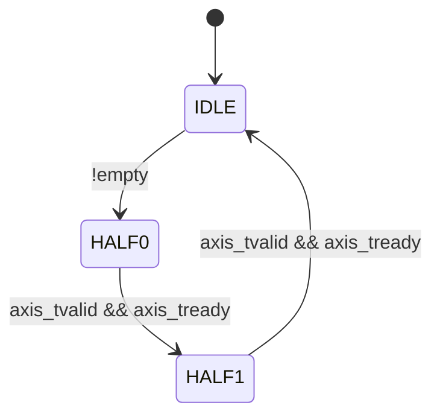

# Output Buffer Controller 规格书

Version: 1.0
Date: 2026-03-08
Module: output_buffer_ctrl.v
Status: 新增文档

## 1. 模块概述
输出缓冲模块，包含 128b FIFO 与 128->64 Gearbox，输出 AXI-Stream 帧并生成 tlast。

## 2. 参数
| 参数 | 默认 | 说明 |
| --- | --- | --- |
| DEPTH_LOG2 | 8 | FIFO 深度 = 2^DEPTH_LOG2 |

## 3. 接口定义
### 3.1 写端 (PPU)
| 信号 | 宽度 | 方向 | 说明 |
| --- | --- | --- | --- |
| i_data | 128 | In | 写入数据 |
| i_valid | 1 | In | 写入有效 |
| o_full | 1 | Out | FIFO 满 |

### 3.2 读端 (AXI-Stream)
| 信号 | 宽度 | 方向 | 说明 |
| --- | --- | --- | --- |
| axis_tdata | 64 | Out | 输出数据 |
| axis_tvalid | 1 | Out | 输出有效 |
| axis_tready | 1 | In | 下游就绪 |
| axis_tlast | 1 | Out | 帧结束 |

### 3.3 配置
| 信号 | 宽度 | 方向 | 说明 |
| --- | --- | --- | --- |
| i_cfg_seq_len | 32 | In | 序列长度，帧 beat 数为 seq_len*2 |

### 3.4 Debug
| 信号 | 宽度 | 方向 | 说明 |
| --- | --- | --- | --- |
| dbg_obuf_wr_ptr | 8 | Out | 写指针 |
| dbg_obuf_rd_ptr | 8 | Out | 读指针 |
| dbg_obuf_full | 1 | Out | FIFO 满 |

## 4. 时序/延迟
- FIFO 写入无延迟。
- 读端 FSM 每 2 拍输出 1 个 128b。
- axis_tlast 在帧内最后一个 beat 置 1。

## 5. 关键设计机制
- 读端 FSM：IDLE -> HALF0 -> HALF1。
- frame_beats = i_cfg_seq_len << 1。

## 6. 复位/初始化
- rst_n 清零指针与状态机。

## 局部数据流动
- i_data/i_valid 写入 128b FIFO，o_full 反馈上游背压。
- 读端 FSM 从 FIFO 取 128b，分两拍输出 64b。
- axis_tready 握手控制 beat 递增与 rd_ptr 更新。
- i_cfg_seq_len 映射为 frame_beats=seq_len*2，驱动 tlast。
- frame_active 在帧内保持稳定，帧尾回到 IDLE。
- dbg_obuf_* 指针用于定位丢包与背压问题。

## 状态机控制图

